# Forecasting deaths and analyzing age trends of COVID-19 cases in Florida

*Updated: 30 July 2020*

Author: Marc Bevand

The Florida Department of Health (FDOH) has an **amazing** dataset here:
[complete line list of the state's COVID-19 cases and deaths][dataset]. To our
knowledge, it is the only *open* dataset documenting the exact age of hundreds
of thousands of cases. This gives us great insights because age is a very
important factor affecting the Case Fatality Ratio (CFR) of COVID-19. This
repository provides tools to analyze the data:

* [forecast_deaths.py](forecast_deaths.py) forecasts deaths in the state, based on various age-stratified CFR estimates
* [age_stratified_cfr.py](age_stratified_cfr.py) calculates the age-stratified CFR, based on recent deaths in the state
* [gamma.py](gamma.py) calculates the times between onset of symptoms and death (onset-to-death) and fits them in a Gamma distribution
* [heatmap.py](heatmap.py) creates a heatmap representing the number of cases by age bracket evolving over time

## FDOH line list

To download the FDOH line list, browse the [data page][dataset] and click
`Download` in the top right corner. However we already made daily archives of the line
list in directory [data_fdoh](data_fdoh) so there is no need to download it.

The line list is in CSV format and the columns are self-explanatory: `Age`,
`Gender`, `County`, boolean `Died`, etc. The columns are documented on page 12 of this
[FDOH document][def]. Two important columns:

`ChartDate` is the date used to create the bar chart in the FDOH [dashboard][dashboard].

`EventDate` is the date when symptoms started, or if that date is unknown, the
date lab results were reported to the FDOH. One of our sources claim more
precisely this date is the earlier of onset date, diagnosis date, or test date.
Our scripts trust the FDOH and assume `EventDate` is generally the onset date,
but we are aware this column may have data quality issues.

## Forecasting deaths

Most recent forecast:

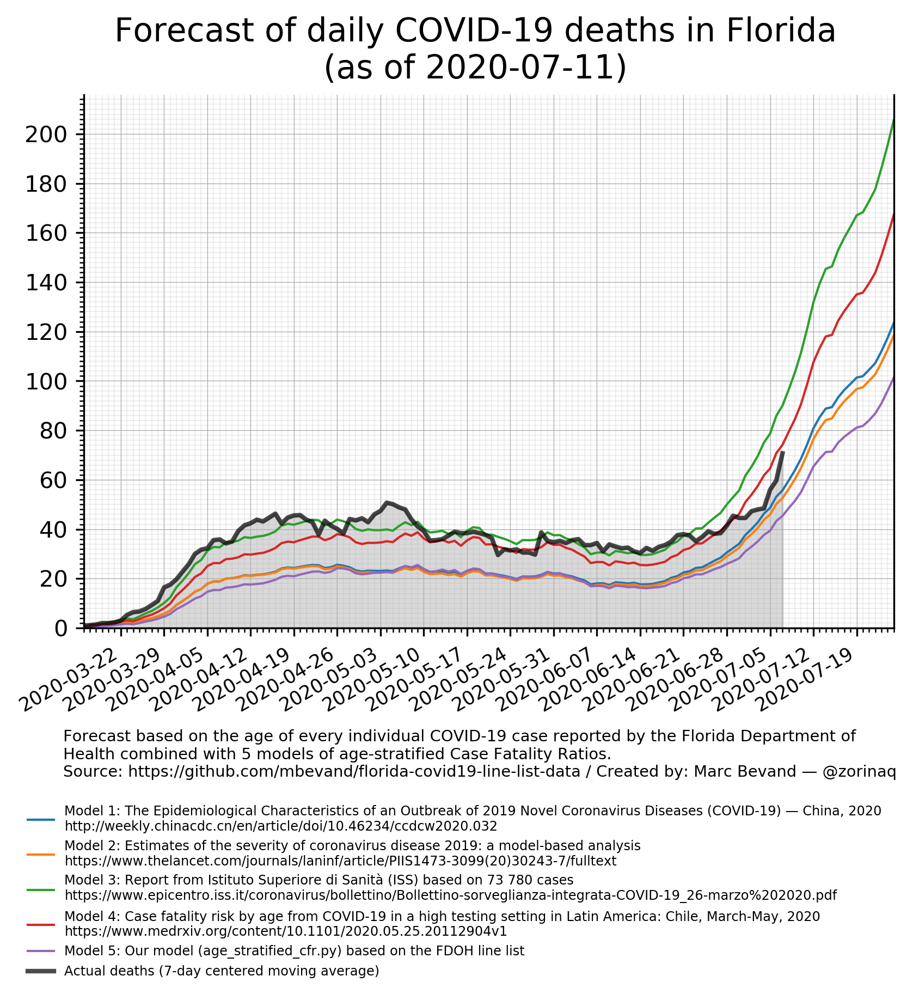

[Previous forecasts](historical):

* [2020-07-05 forecast](https://raw.githubusercontent.com/mbevand/florida-covid19-line-list-data/master/historical/forecast_deaths_2020-07-05.png), first published [here](https://twitter.com/zorinaq/status/1279934357323386880)
* [2020-07-11 forecast](https://raw.githubusercontent.com/mbevand/florida-covid19-line-list-data/master/historical/forecast_deaths_2020-07-11.png), first published [here](https://twitter.com/zorinaq/status/1282184250163224576)
* [2020-07-14 forecast](https://raw.githubusercontent.com/mbevand/florida-covid19-line-list-data/master/historical/forecast_deaths_2020-07-14.png), first published [here](https://twitter.com/zorinaq/status/1283195508777824256)
* [2020-07-18 forecast](https://raw.githubusercontent.com/mbevand/florida-covid19-line-list-data/master/historical/forecast_deaths_2020-07-18.png), first published [here](https://twitter.com/zorinaq/status/1284544737110683648)
* [2020-07-22 forecast](https://raw.githubusercontent.com/mbevand/florida-covid19-line-list-data/master/historical/forecast_deaths_2020-07-22.png), first published [here](https://twitter.com/zorinaq/status/1286054539003482114)
* [2020-07-26 forecast](https://raw.githubusercontent.com/mbevand/florida-covid19-line-list-data/master/historical/forecast_deaths_2020-07-26.png), first published [here](https://twitter.com/zorinaq/status/1287650007340822528)
* [2020-07-30 forecast](https://raw.githubusercontent.com/mbevand/florida-covid19-line-list-data/master/historical/forecast_deaths_2020-07-30.png), first published [here](https://twitter.com/zorinaq/status/1288951536299565056)

Our previous forecasts have been accurate, for example our first forecasts
accurately predicted the increase of deaths in July:

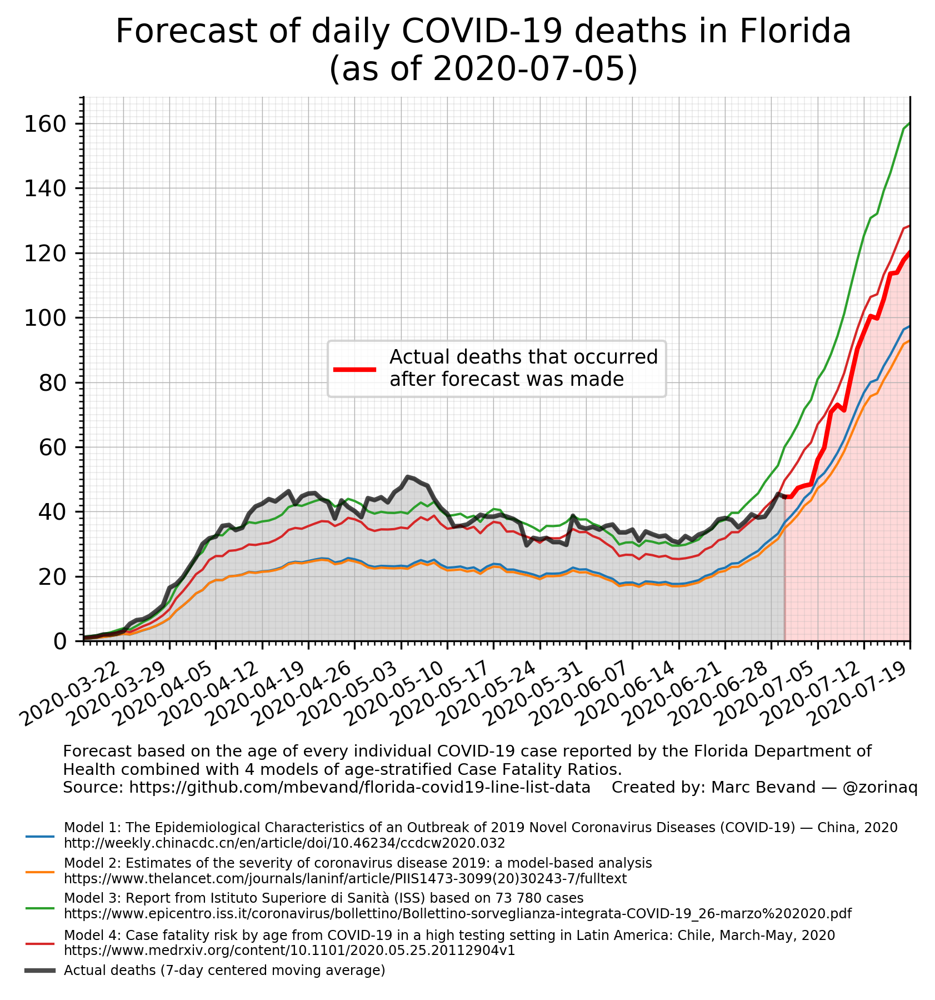

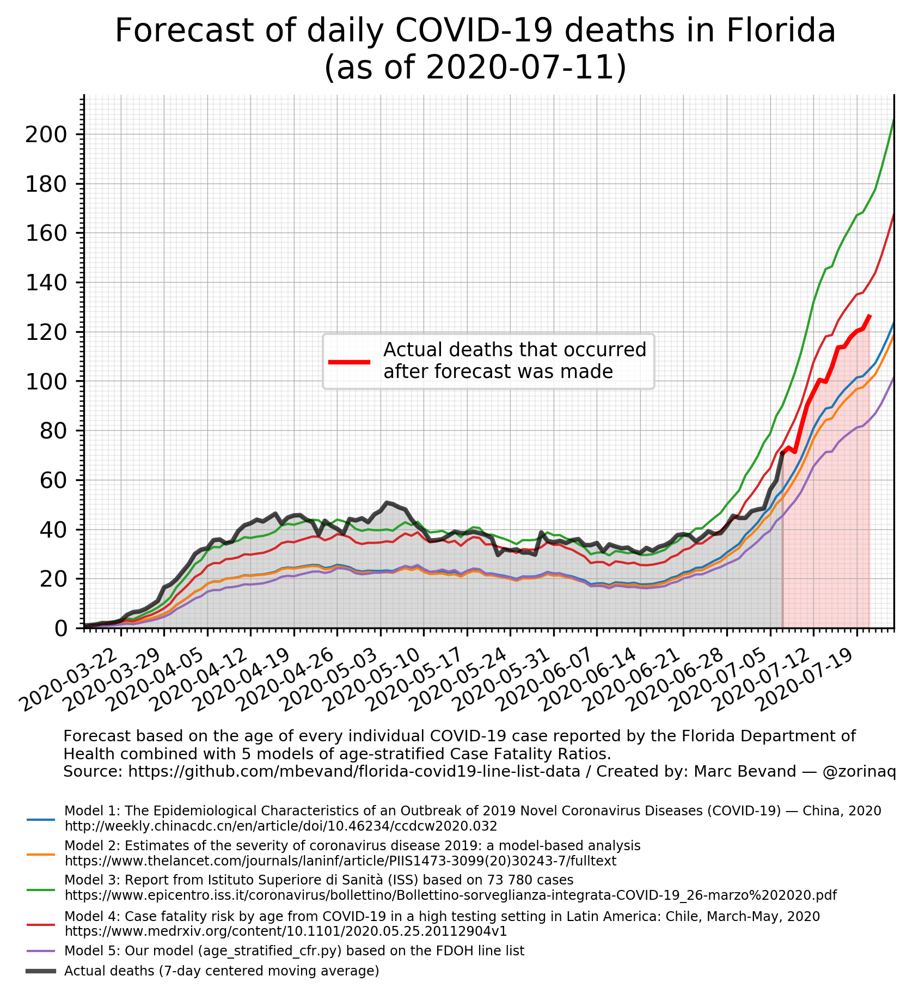

`forecast_deaths.py` does not rely on death data, but relies *solely* on case
ages, date of onset of symptoms, and various estimates of the age-stratified CFR.
The script starts by opening the latest line list CSV file (in directory [data_fdoh](data_fdoh))
or if no such file exists it downloads it from the [FDOH line list page][dataset].
This gives us (1) the age of every case diagnosed with COVID-19, and (2) the
date of onset of symptoms (`EventDate` CSV column.)

The script multiplies the numbers of cases in specific age brackets by the
corresponding age-stratified CFR. The age-stratified CFR estimates are issued
from 5 independent models:

* Model 2: [Estimates of the severity of coronavirus disease 2019: a model-based analysis][m2] (table 1, CFR, Adjusted for censoring, demography, and under-ascertainment)
* Model 4: [Case fatality risk by age from COVID-19 in a high testing setting in Latin America: Chile, March-May, 2020][m4] (table 2, Latest estimate)
* Model 5: CFR calculated on the Florida line list by the script `age_stratified_cfr.py`

Model 1 was removed on 2020-07-26 as it is based on the same case data as model 2 but without adjustments for censoring and under-ascertainment:
* Model 1: [The Epidemiological Characteristics of an Outbreak of 2019 Novel Coronavirus Diseases (COVID-19) — China, 2020][m1] (table 1, Case fatality rate)

Model 3 was removed on 2020-07-26 as it did not prove to be as reliable as the others:
* Model 3: [https://www.epicentro.iss.it/coronavirus/bollettino/Bollettino-sorveglianza-integrata-COVID-19_26-marzo%202020.pdf][m3] (table 1, Casi totali, % Letalità)

Experimentally, we have observed that deaths fall somewhere in the range of
estimates produced by these CFR models (eg. model 4 tends to overestimate, and
model 5 tends to underestimate.) To refine our estimates, since 2020-07-26
we also produce a *best guess forecast*:

* We assume the rate of increase/decrease of daily deaths is most closely
  forecast by model 5
* We calculate a factor `adj_factor` by which model 5 estimates can be multiplied
  to produce a perfect estimate for the present day
* For our best guess upper bound: the next day, `adj_factor` is multiplied by 1.05
  (5% error margin), for every subsequent day `adj_factor` is multiplied by 1.005
  (accumulates 0.5% daily error margin)
* For our best guess lower bound: same, but with 0.95, and 0.995

Since the forecast is based on line list case data, ie. *detected* cases, it is
important that we feed it CFR estimates, not IFR estimates. Infection Fatality
Ratios take into account *undetected* cases and thus would not be consistent
with line list data.

Then the script assumes death occurs on average 18.5 days after infection,
which is the mean onset-to-death time calculated by `gamma.py`.

Finally, it charts the forecast (`forecast_deaths.png`). The curves are all
smoothed with a 7-day simple moving average.

The end result is a simple tool that can not only predict deaths up to ~18.5
days ahead of time, but can also estimate *past* deaths accurately: notice how
the colored curves in the generated chart follow closely the black curve
(actual deaths.)

Historical data for actual deaths was fetched from the [New York Times Covid-19
data repository][nyt] and was saved in the file [data_deaths/fl_resident_deaths.csv](data_deaths/fl_resident_deaths.csv).
Death data is only used to draw the black curve. It is *not* used in the
forecasts based on CFR models #1 through #4. Actual deaths are only used
indirectly in the forecast based on model #5, because model #5 uses the
age-stratified CFR calculated from Florida deaths.

Note: since 2020-07-14 the file `data_deaths/fl_resident_deaths.csv` is now
updated by the script [data_fdoh/download](data_fdoh/download) that obtains deaths directly from
the FDOH line list. The number of deaths calculated by the script is off by one
from the "Florida Resident Deaths" figure shown on the [state's
dashboard][dashboard] because our script only accounts for deaths whose `Jurisdiction`
is `FL resident` (consistent with the way NYT does it in their
[repository][nyt],) whereas the state's dashboard includes 1 additional death
whose `Jurisdiction` is `Not diagnosed/isolated in FL`.

## Age-stratified CFR

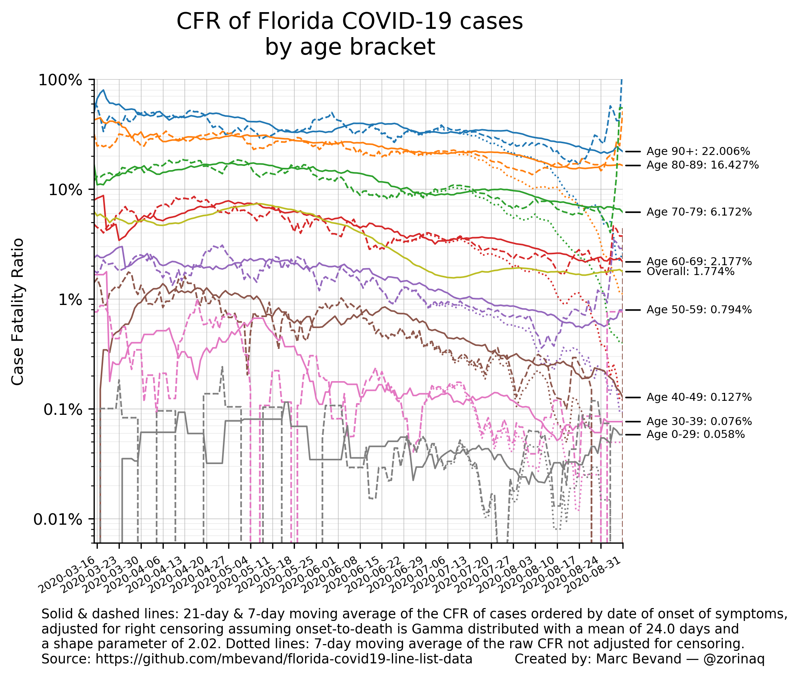

`age_stratified_cfr.py` opens the latest line list CSV file (in directory [data_fdoh](data_fdoh))
or if no such file exists it downloads it from the [FDOH line list page][dataset].
It calculates the 7-day moving average of the raw CFR of various age brackets,
with cases ordered by date of onset of symptoms.

The script also calculates the 7-day (short-term) and 21-day (long-term) moving
average of the CFR ajusted for right censoring. The adjustment is performed by
using the parameters of the Gamma distribution of onset-to-death calculated by
`gamma.py`. The long-term average is calculated over 21 days shifted by 7 days
(days D-7 through D-27) because despite best efforts to adjust for censoring,
the number of deaths in the last 7 days still remains too incomplete to make the
adjustment accurate (garbage in, garbage out.)

All the moving averages are calculated by assigning equal *weight* to each
day's CFR value. If they were calculated by summing all cases and deaths across
the entire 7-day or 21-day period, this would give too much weight to days
with more cases and would not be representative of the overall average over
the entire 7 or 21 days.

The results of these CFR calculations are charted in `age_stratified_cfr.png`.

The short-term adjusted CFR curve helps visualize the magnitude of right censoring:
the curve follows the same peaks and valleys as the raw CFR, but deviates
more greatly toward the right of the time axis, as censoring increases.

The long-term adjusted CFR curve, especially its last value labelled on the chart,
represents our best guess of the age-stratified CFR of COVID-19.

## Gamma distribution of onset-to-death

Overall distribution (all ages):

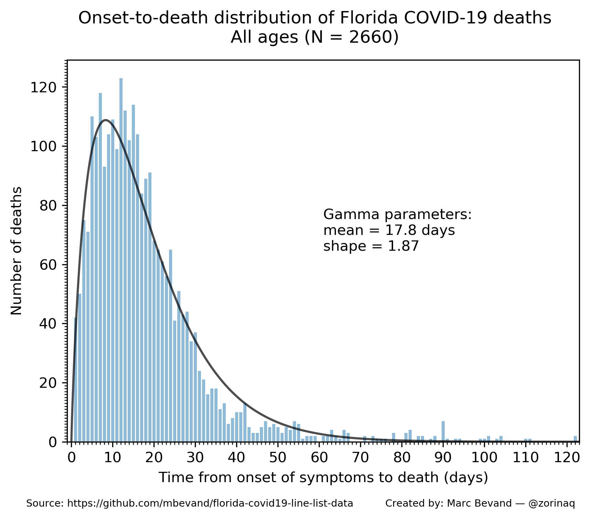

Distribution by age bracket:

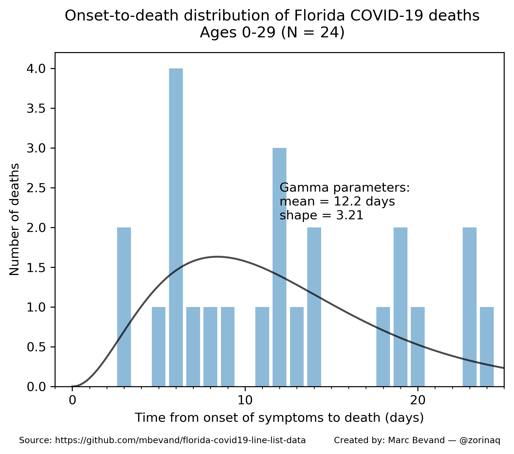

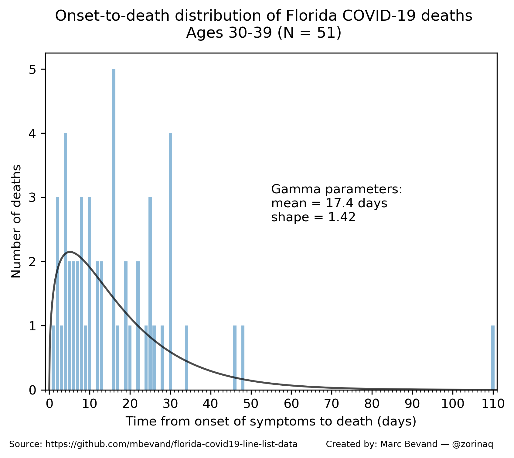

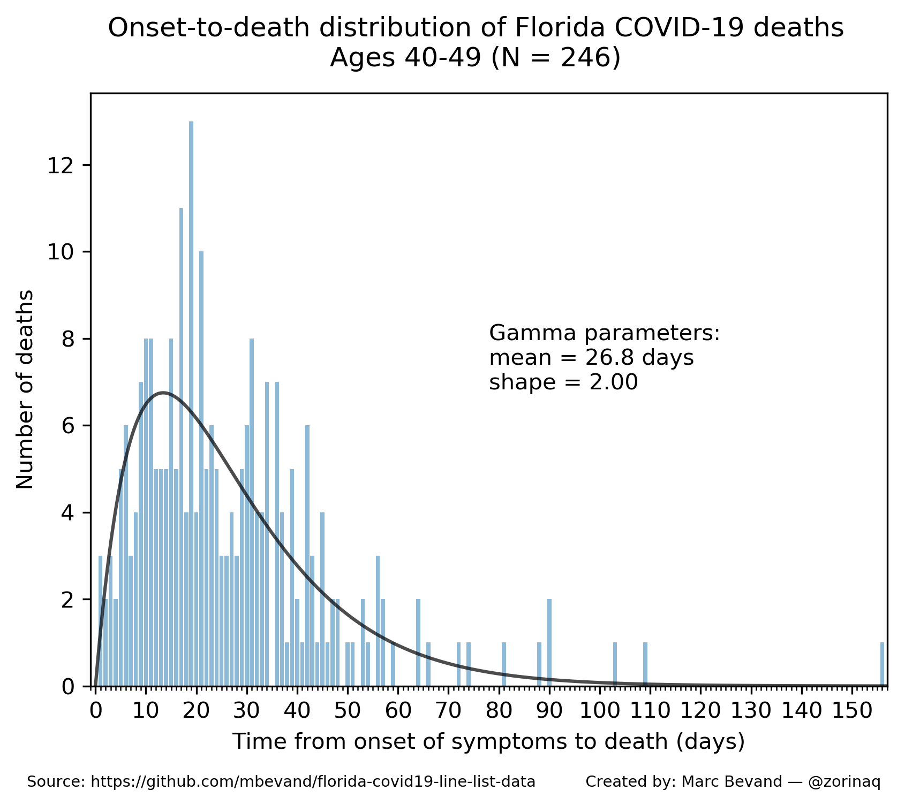

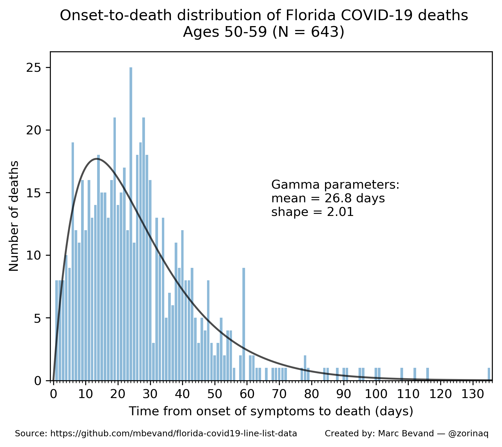

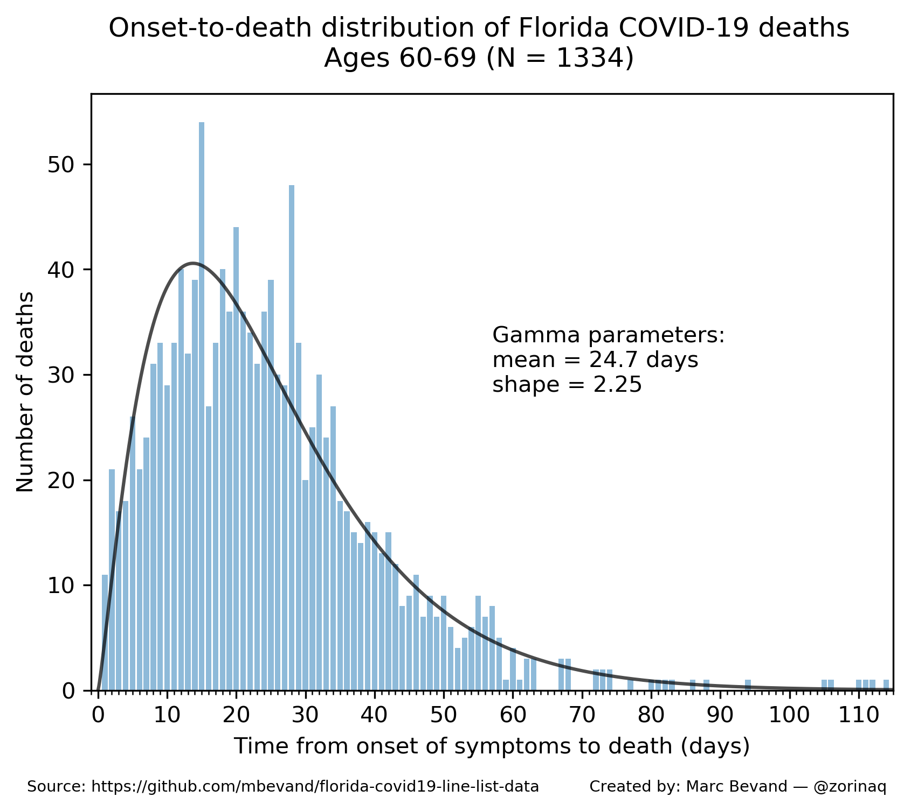

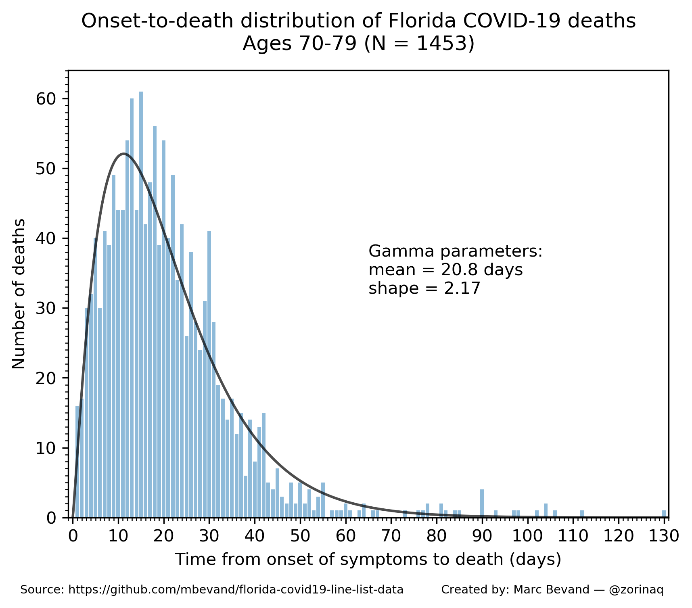

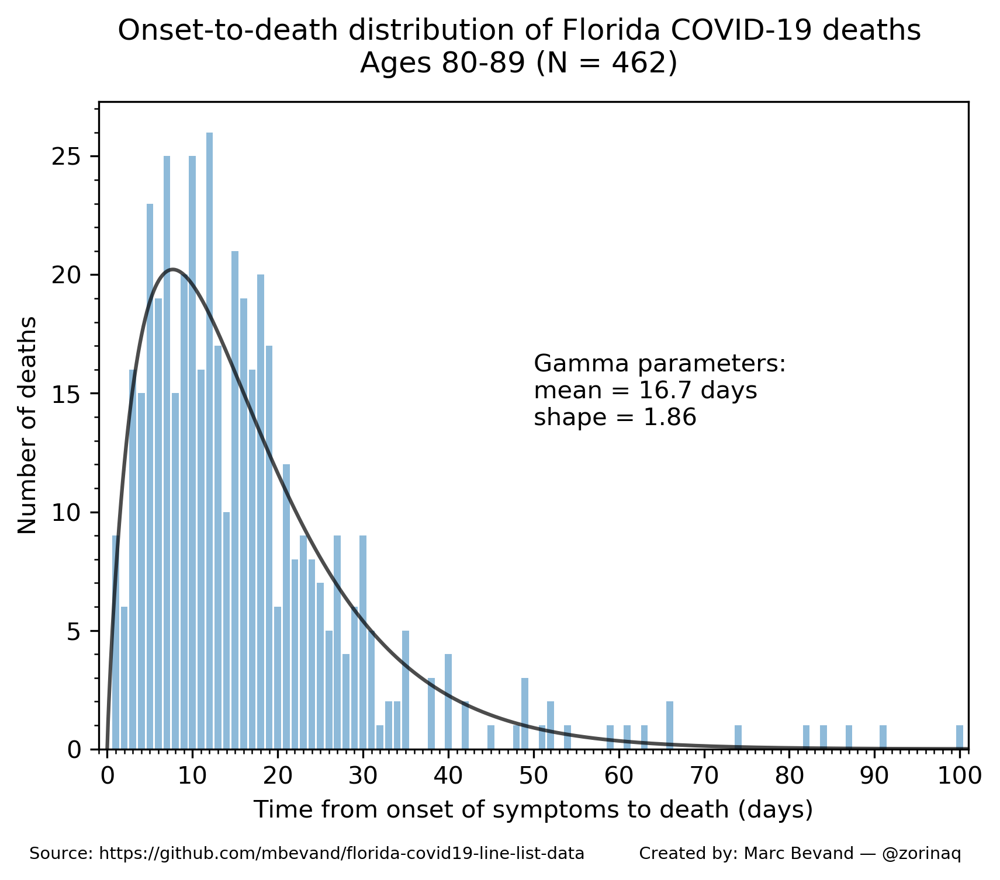

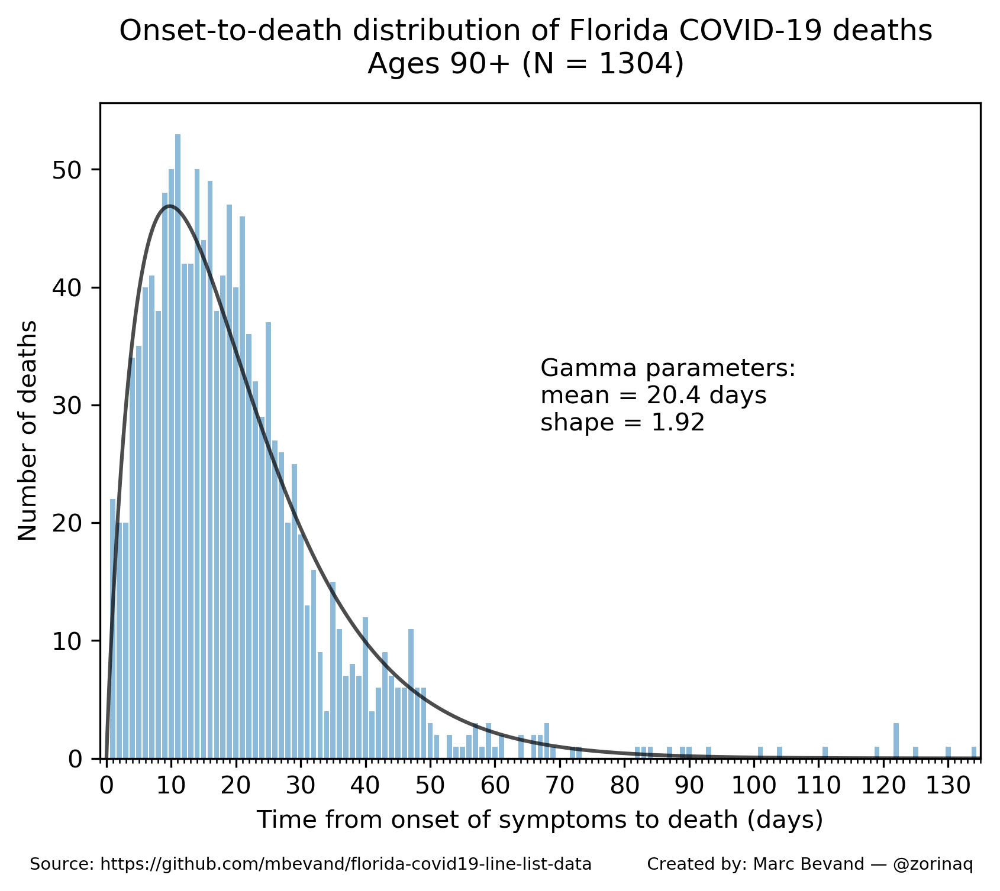

`gamma.py` calculates the times between onset of symptoms and death
(onset-to-death) and fits them in a Gamma distribution. It creates
multiple charts for different age brackets (`gamma*.png`) and outputs a
numerical summary.

The date of onset is known (`EventDate`). However FDOH does not publish the
date of death, so `gamma.py` infers it from updates made to the line list. We
made daily archives of the line list in directory [data_fdoh](data_fdoh). Pass these files
as arguments to `gamma.py`, it will parse them, and when it detects a new death
(`Died` changed to `Yes`), it infers the date of death was one day before the
line list was updated, because FDOH updates the line list with data as of the
prior day.

```
$ ./gamma.py data_fdoh/*.csv
Parsing data_fdoh/2020-06-27-00-00-00.csv
Parsing data_fdoh/2020-06-28-00-00-00.csv
Parsing data_fdoh/2020-06-29-09-51-00.csv
Parsing data_fdoh/2020-06-30-19-26-00.csv
Parsing data_fdoh/2020-07-01-07-49-00.csv
Parsing data_fdoh/2020-07-02-13-38-00.csv
Parsing data_fdoh/2020-07-03-09-16-00.csv
Parsing data_fdoh/2020-07-04-13-44-00.csv
Parsing data_fdoh/2020-07-05-08-44-00.csv
Parsing data_fdoh/2020-07-06-08-18-00.csv
Parsing data_fdoh/2020-07-07-09-06-00.csv
Parsing data_fdoh/2020-07-08-10-21-00.csv
Parsing data_fdoh/2020-07-09-11-09-00.csv
Parsing data_fdoh/2020-07-10-09-46-54.csv
Parsing data_fdoh/2020-07-11-11-04-49.csv
Parsing data_fdoh/2020-07-12-09-53-27.csv
Parsing data_fdoh/2020-07-13-07-57-16.csv
Parsing data_fdoh/2020-07-14-14-09-16.csv
Parsing data_fdoh/2020-07-15-09-09-26.csv
Parsing data_fdoh/2020-07-16-07-58-41.csv
Parsing data_fdoh/2020-07-17-09-17-34.csv
Parsing data_fdoh/2020-07-18-08-58-55.csv
Parsing data_fdoh/2020-07-19-10-12-32.csv
Parsing data_fdoh/2020-07-20-08-30-29.csv
Parsing data_fdoh/2020-07-21-09-22-37.csv
Parsing data_fdoh/2020-07-22-08-26-38.csv
Parsing data_fdoh/2020-07-23-09-44-13.csv
Parsing data_fdoh/2020-07-24-09-32-33.csv
Parsing data_fdoh/2020-07-25-07-38-52.csv
Parsing data_fdoh/2020-07-26-08-01-29.csv
Parsing data_fdoh/2020-07-27-11-17-26.csv
Parsing data_fdoh/2020-07-28-09-08-33.csv
Parsing data_fdoh/2020-07-29-11-28-29.csv
Parsing data_fdoh/2020-07-30-12-31-00.csv

Ages 0-29:
Number of deaths: 31
Gamma distribution params:
mean = 15.2
shape = 2.04

Ages 30-39:
Number of deaths: 63
Gamma distribution params:
mean = 17.5
shape = 1.51

Ages 40-49:
Number of deaths: 110
Gamma distribution params:
mean = 21.7
shape = 1.95

Ages 50-59:
Number of deaths: 247
Gamma distribution params:
mean = 22.0
shape = 1.81

Ages 60-69:
Number of deaths: 519
Gamma distribution params:
mean = 19.2
shape = 2.08

Ages 70-79:
Number of deaths: 881
Gamma distribution params:
mean = 19.2
shape = 1.95

Ages 80-89:
Number of deaths: 996
Gamma distribution params:
mean = 17.6
shape = 1.99

Ages 90+:
Number of deaths: 556
Gamma distribution params:
mean = 16.2
shape = 1.92

All ages:
Number of deaths: 3403
Gamma distribution params:
mean = 18.5
shape = 1.93
```

The overall (all ages) mean of 18.5 days is comparable to other published estimates, however our
distribution is wider (ie. smaller shape parameter of 1.93) because many deaths
occur in the long tail:
* mean 17.8 days, shape 4.94 = 0.45<sup>-2</sup>, based on sample of 24 deaths: [Estimates of the severity of coronavirus disease 2019: a model-based analysis][verity]
* mean 15.1 days, shape 5.1, based on sample of 3 deaths: [Estimating case fatality ratio of COVID-19 from observed cases outside China][althaus]

We believe our distribution parameters are more accurate because
they are based on a much larger sample of 3403 deaths. The long tail
may be the result of improved treatments that can maintain patients
alive for a longer time.

We notice differences between age brackets. For example patients aged 0-29
years have the shortest onset-to-death time (mean of 12.9 days.) However
for the purpose of calculating the age-stratified CFR (`age_stratified_cfr.py`)
and forecasting deaths (`forecast_deaths.py`) we do not use age-specific
Gamma parameters. Instead we simply use the parameters of the overall distribution
(all ages.)

Limitations: it is likely our technique does not always accurately identify the
date of death. For example FDOH could be updating the line list many days after
the death occured (contributing to the long tail.) Furthermore, there are data
quality issues in the `EventDate` column of the FDOH line list, meaning this
date does not always accurately reflect the date of onset.

## Heatmap of age over time

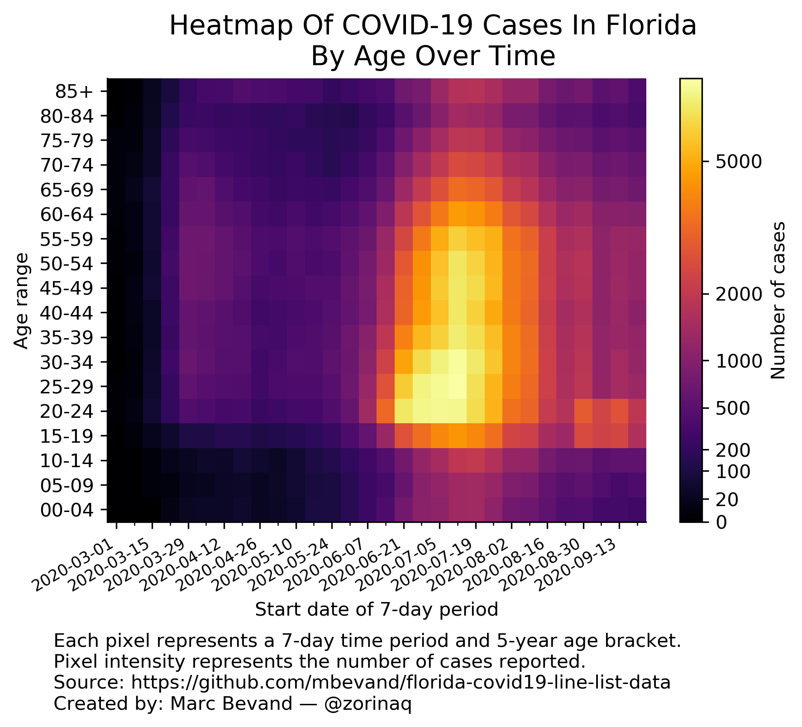


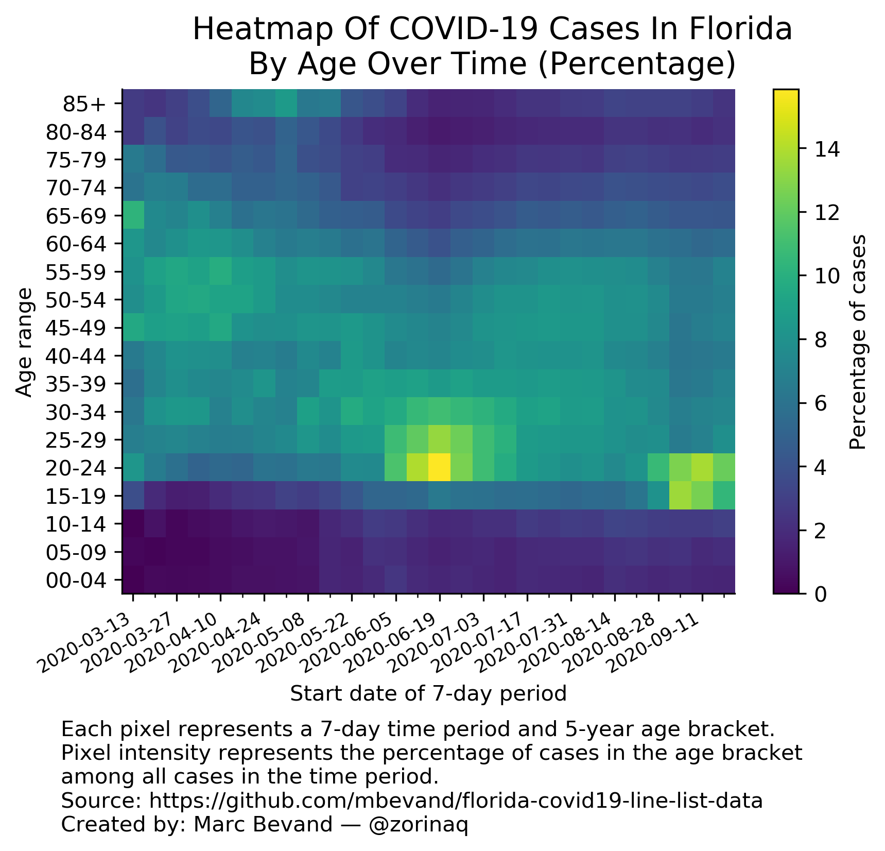

`heatmap.py` opens the latest line list CSV file (in directory [data_fdoh](data_fdoh))
or if no such file exists it downloads it from the [FDOH line list page][dataset].
It creates various heatmaps of cases by age over time:

* In `heatmap.png` the pixel intensity represents the number of cases
* In `heatmap_per_capita.png` the pixel intensity represents the number of cases per capita
* In `heatmap_age_share.png` the pixel intensity represents the percentage of cases in the age bracket among all cases in this time period

`heatmap.py` also produces a numerical summary:

```
$ ./heatmap.py
Opening data_fdoh/2020-07-26-08-01-29.csv
Number of COVID-19 cases per 7-day time period in Florida by age bracket over time:
period_start, 00-04, 05-09, 10-14, 15-19, 20-24, 25-29, 30-34, 35-39, 40-44, 45-49, 50-54, 55-59, 60-64, 65-69, 70-74, 75-79, 80-84, 85+, median_age
  2020-03-01,     0,     0,     0,     0,     1,     1,     0,     0,     0,     0,     1,     1,     2,     2,     2,     3,     0,     0,  65.0
  2020-03-08,     0,     0,     0,     4,     7,     3,     2,     5,     6,     8,     4,     8,     9,    17,    10,     4,     3,     1,  59.0
  2020-03-15,     0,     2,     3,    21,    57,    48,    45,    36,    34,    63,    54,    64,    64,    67,    40,    41,    30,    26,  53.0
  2020-03-22,    10,     5,    17,    49,   204,   222,   284,   254,   272,   273,   315,   297,   235,   235,   237,   176,   120,    84,  50.0
  2020-03-29,    32,    21,    28,   109,   428,   577,   652,   583,   604,   701,   716,   705,   630,   550,   470,   345,   234,   228,  50.0
  2020-04-05,    34,    25,    42,   108,   383,   481,   568,   541,   577,   669,   699,   706,   636,   593,   419,   314,   262,   325,  51.0
  2020-04-12,    37,    35,    41,   142,   330,   437,   465,   495,   490,   608,   595,   614,   493,   404,   335,   270,   220,   344,  50.0
  2020-04-19,    49,    39,    67,   149,   341,   428,   459,   467,   416,   462,   518,   499,   441,   332,   279,   260,   246,   424,  50.0
  2020-04-26,    29,    29,    55,   111,   251,   296,   308,   339,   305,   348,   375,   382,   323,   301,   240,   237,   205,   383,  52.0
  2020-05-03,    37,    38,    35,   132,   276,   364,   355,   321,   319,   364,   328,   373,   297,   245,   225,   212,   202,   363,  50.0
  2020-05-10,    51,    58,    60,   151,   313,   401,   435,   399,   354,   399,   424,   432,   352,   270,   261,   191,   225,   334,  49.0
  2020-05-17,    94,    88,    98,   193,   329,   392,   423,   417,   392,   443,   357,   379,   306,   257,   197,   189,   161,   312,  46.0
  2020-05-24,    91,    94,   136,   242,   425,   481,   545,   490,   469,   447,   375,   445,   336,   237,   165,   159,   145,   207,  42.0
  2020-05-31,   162,   161,   201,   401,   624,   707,   693,   707,   594,   618,   560,   540,   413,   333,   231,   182,   138,   270,  40.0
  2020-06-07,   257,   256,   290,   592,  1406,  1291,  1159,  1022,   814,   845,   808,   691,   577,   407,   322,   235,   206,   328,  37.0
  2020-06-14,   392,   342,   435,  1276,  3359,  2755,  2320,  1940,  1608,  1557,  1365,  1281,   916,   651,   529,   378,   272,   378,  34.0
  2020-06-21,   767,   645,   765,  2762,  6600,  5834,  4815,  3911,  3234,  3197,  2949,  2444,  1869,  1350,   991,   718,   501,   725,  34.0
  2020-06-28,  1068,  1047,  1203,  3478,  7135,  6999,  6235,  5305,  4598,  4459,  4312,  3751,  2823,  2040,  1464,  1057,   680,   830,  36.0
  2020-07-05,  1117,  1187,  1528,  4129,  7242,  7340,  6969,  5970,  5583,  5778,  5562,  5017,  3774,  2713,  1998,  1499,  1063,  1308,  39.0
  2020-07-12,  1384,  1385,  1930,  4481,  7228,  7590,  7462,  6842,  6648,  6627,  6560,  5942,  4617,  3456,  2600,  1926,  1430,  1763,  41.0
  2020-07-19,  1432,  1416,  2030,  4147,  6341,  6435,  6729,  6397,  6009,  6294,  6083,  5556,  4446,  3277,  2463,  1899,  1376,  1800,  41.0
(Last period's data may be incomplete. Age unknown for 778 out of 423855 cases.)
```

By default the size of each pixel, or *bucket*, is 5-year age brackets and 7-day
time periods. This can be changed by editing the variables `buckets_ages` and `buckets_days`
in `heatmap.py`.

## Miscellaneous

`sort.py` is a tool that strips the `ObjectId` column from a line list CSV file
and sorts the rows. This is helpful to compare 2 CSV files published on 2
different days, because the `ObjectId` value and the order of rows are not
stable from one file to another.

## Other COVID-19 line lists

* [Ohio](https://coronavirus.ohio.gov/wps/portal/gov/covid-19/dashboards/overview) (click *Download the summary data (CSV)*)
* [Virginia](https://www.vdh.virginia.gov/coronavirus/)
* [Tokyo](https://twitter.com/sugi2000/status/1285325952981983232)

[dataset]: https://www.arcgis.com/home/item.html?id=4cc62b3a510949c7a8167f6baa3e069d
[def]: https://justthenews.com/sites/default/files/2020-07/Data_Definitions_05182020-2.pdf
[m1]: http://weekly.chinacdc.cn/en/article/doi/10.46234/ccdcw2020.032
[m2]: https://www.thelancet.com/journals/laninf/article/PIIS1473-3099(20)30243-7/fulltext
[m3]: https://www.epicentro.iss.it/coronavirus/bollettino/Bollettino-sorveglianza-integrata-COVID-19_26-marzo%202020.pdf
[m4]: https://www.medrxiv.org/content/10.1101/2020.05.25.20112904v1
[nyt]: https://raw.githubusercontent.com/nytimes/covid-19-data/master/us-states.csv
[dashboard]: https://experience.arcgis.com/experience/96dd742462124fa0b38ddedb9b25e429
[verity]: https://www.thelancet.com/journals/laninf/article/PIIS1473-3099(20)30243-7/fulltext
[althaus]: https://github.com/calthaus/ncov-cfr/
