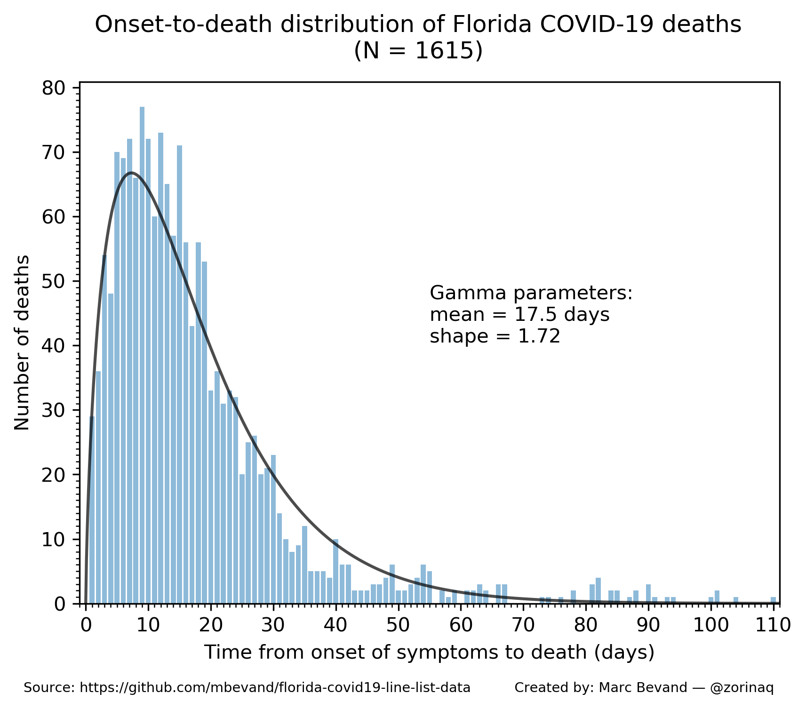

# Forecasting deaths and analyzing age trends of COVID-19 cases in Florida

*Updated: 11 July 2020*

Authors: Marc Bevand, Michael A. Alcorn

The Florida Department of Health (FDOH) has an **amazing** dataset here:
[complete line list of the state's COVID-19 cases and deaths][dataset]. To our
knowledge, it is the only *open* dataset documenting the exact age of hundreds
of thousands of cases. This gives us great insights because age is a very
important factor affecting the Case Fatality Ratio (CFR) of COVID-19. This
repository provides tools to analyze the data:

* `forecast_deaths.py` forecasts deaths in the state, based on various age-stratified CFR estimates
* `age_stratified_cfr.py` calculates the age-stratified CFR, based on recent deaths in the state
* `gamma.py` calculates the times between onset of symptoms and death (onset-to-death) and fits them in a Gamma distribution
* `heatmap.py` creates a heatmap representing the number of cases by age bracket evolving over time

## FDOH line list

To download the FDOH line list, browse the [data page][dataset] and click
`Download → Spreadsheet`. We made daily archives of the line list in directory
`data_fdoh`.

The line list is in CSV format and the columns are self-explanatory: `Age`,
`Gender`, `County`, boolean `Died`, etc. The columns are documented on page 12 of this
[FDOH document][def]. Two important columns:

`ChartDate` is the date used to create the bar chart in the FDOH dashboard.

`EventDate` is the date when symptoms started, or if that date is unknown, the
date lab results were reported to the FDOH. One of our sources claim more
precisely this date is the earlier of onset date, diagnosis date, or test date.
Our scripts trust the FDOH and assume `EventDate` is generally the onset date,
but we are aware this column may have data quality issues.

## Forecasting deaths


`forecast_deaths.py` does not rely on death data, but relies *solely* on case
ages, date of onset of symptoms, and various estimates of the age-stratified CFR.
The script starts by opening the latest line list CSV file (in directory `data_fdoh`)
or if no such file exists it downloads it from the [FDOH line list page][dataset].
This gives us (1) the age of every case diagnosed with COVID-19, and (2) the
date of onset of symptoms (`EventDate` CSV column.)

The script multiplies the numbers of cases in specific age brackets by the
corresponding age-stratified CFR. The age-stratified CFR estimates are issued
from 5 independent models:

* Model 1: [The Epidemiological Characteristics of an Outbreak of 2019 Novel Coronavirus Diseases (COVID-19) — China, 2020][m1] (table 1, Case fatality rate)
* Model 2: [Estimates of the severity of coronavirus disease 2019: a model-based analysis][m2] (table 1, CFR, Adjusted for censoring, demography, and under-ascertainment)
* Model 3: [https://www.epicentro.iss.it/coronavirus/bollettino/Bollettino-sorveglianza-integrata-COVID-19_26-marzo%202020.pdf][m3] (table 1, Casi totali, % Letalità)
* Model 4: [Case fatality risk by age from COVID-19 in a high testing setting in Latin America: Chile, March-May, 2020][m4] (table 2, Latest estimate)
* Model 5: CFR calculated by the script `age_stratified_cfr.py`

Since the forecast is based on line list case data, ie. *detected* cases, it is
important that we feed it CFR estimates, not IFR estimates. Infection Fatality
Ratios take into account *undetected* cases and thus would not be consistent
with line list data.

Then the script assumes death occurs on average 18.7 days after infection,
which is the mean onset-to-death time calculated by `gamma.py`.

The end result is a simple tool that can not only predict deaths up to ~18.7
days ahead of time, but can also estimate *past* deaths accurately: notice how
the colored curves in the generated chart follow closely the black curve
(actual deaths.)

The curves are all smoothed with a 7-day centered moving average.

Actual deaths are fetched from the [New York Times Covid-19 data repository][nyt] and
are only used to draw the black curve. They are *not* used in the forecasts
based on CFR models #1 through #4. Actual deaths are only used indirectly in
the forecast based on model #5 as its age-stratified CFR is calculated by
`age_stratified_cfr.py` which analyzes Florida deaths.

## Age-stratified CFR


`age_stratified_cfr.py` opens the latest line list CSV file (in directory `data_fdoh`)
or if no such file exists it downloads it from the [FDOH line list page][dataset].
It calculates the 7-day moving average of the raw CFR of various age brackets,
with cases ordered by date of onset of symptoms.

The script also calculates the 7-day (short-term) and 28-day (long-term) moving
average of the CFR ajusted for right censoring. The adjustment is performed by
using the parameters of the Gamma distribution of onset-to-death calculated by
`gamma.py`.

The results of these calculations are charted in `age_stratified_cfr.png`.

The short-term adjusted CFR curve helps visualize the magnitude of right censoring:
the curve follows the same peaks and valleys as the raw CFR, but deviates
more greatly toward the right of the time axis, as censoring increases.

The long-term adjusted CFR curve, especially its last value labelled on the chart,
represents our best guess of the age-stratified CFR of COVID-19.

## Gamma distribution of onset-to-death



`gamma.py` calculates the times between onset of symptoms and death
(onset-to-death) and fits them in a Gamma distribution.

The date of onset is known (`EventDate`). However FDOH does not publish the
date of death, so `gamma.py` infers it from updates made to the line list. We
made daily archives of the line list in directory `data_fdoh`. Pass these files
as arguments to `gamma.py`, it will parse them, and when it detects a new death
(`Died` changed to `Yes`), it infers the date of death was one day before the
line list was updated, because FDOH updates the line list with data as of the
prior day.

```
$ ./gamma.py data_fdoh/*.csv
Parsing data_fdoh/2020-06-27-00-00-00.csv
Parsing data_fdoh/2020-06-28-00-00-00.csv
Parsing data_fdoh/2020-06-29-09-51-00.csv
Parsing data_fdoh/2020-06-30-19-26-00.csv
Parsing data_fdoh/2020-07-01-07-49-00.csv
Parsing data_fdoh/2020-07-02-13-38-00.csv
Parsing data_fdoh/2020-07-03-09-16-00.csv
Parsing data_fdoh/2020-07-04-13-44-00.csv
Parsing data_fdoh/2020-07-05-08-44-00.csv
Parsing data_fdoh/2020-07-06-08-18-00.csv
Parsing data_fdoh/2020-07-07-09-06-00.csv
Parsing data_fdoh/2020-07-08-10-21-00.csv
Parsing data_fdoh/2020-07-09-11-09-00.csv
Parsing data_fdoh/2020-07-10-09-46-54.csv
Parsing data_fdoh/2020-07-11-11-04-49.csv
Onset-to-death times (in days): [16, 7, 27, 20, 29, 32, 22, 15, 26, 31, 15, 20,
30, 5, 8, 3, 5, 5, 15, 3, 15, 32, 16, 78, 26, 23, 35, 17, 9, 10, 8, 16, 8, 25,
22, 27, 15, 15, 9, 2, 12, 6, 8, 12, 10, 8, 9, 1, 4, 7, 24, 23, 84, 24, 74, 24,
100, 62, 3, 4, 85, 9, 81, 14, 6, 67, 67, 54, 19, 20, 54, 17, 5, 64, 4, 2, 35,
28, 8, 39, 31, 22, 28, 23, 16, 28, 16, 32, 8, 8, 19, 21, 9, 16, 12, 7, 10, 7,
6, 16, 5, 11, 6, 6, 7, 6, 4, 8, 12, 3, 3, 7, 2, 7, 4, 2, 10, 24, 7, 1, 81, 88,
24, 61, 29, 59, 51, 18, 49, 38, 18, 10, 33, 46, 49, 40, 5, 39, 37, 33, 30, 30,
35, 26, 16, 3, 36, 20, 23, 19, 21, 6, 15, 10, 7, 8, 11, 20, 9, 14, 7, 14, 8,
29, 4, 8, 5, 12, 5, 2, 9, 2, 8, 1, 9, 94, 28, 78, 18, 47, 76, 66, 63, 10, 42,
21, 10, 58, 10, 19, 55, 7, 55, 47, 66, 19, 21, 40, 9, 40, 30, 27, 32, 23, 29,
31, 25, 16, 17, 11, 15, 15, 13, 15, 15, 11, 14, 10, 12, 10, 9, 10, 11, 9, 9, 6,
9, 9, 9, 18, 12, 11, 7, 6, 13, 2, 42, 3, 5, 4, 1, 12, 2, 5, 33, 11, 9, 9, 5,
53, 11, 9, 5, 12, 35, 23, 9, 1, 5, 13, 6, 53, 10, 49, 49, 27, 19, 53, 41, 31,
26, 23, 23, 28, 15, 35, 41, 46, 19, 16, 13, 18, 27, 15, 10, 14, 12, 15, 14, 12,
7, 8, 6, 6, 6, 3, 8, 3, 25, 20, 101, 9, 8, 22, 18, 9, 11, 1, 6, 6, 17, 9, 2,
25, 17, 4, 5, 5, 24, 13, 29, 24, 26, 13, 30, 16, 11, 12, 12, 10, 15, 14, 11, 3,
3, 6, 28, 8, 8, 15, 23, 46, 1, 3, 34, 22, 19, 10, 10, 25, 12, 29, 22, 10, 19,
12, 6, 6, 9, 18, 8, 12, 4, 11, 5, 1, 13, 6, 25, 11, 17, 10, 8, 5, 53, 5, 9, 18,
40, 40, 40, 21, 19, 25, 21, 18, 18, 19, 17, 18, 14, 15, 25, 12, 8, 20, 10, 10,
9, 15, 15, 11, 14, 14, 17, 6, 17, 8, 8, 7, 6, 9, 6, 8, 17, 3, 4, 6, 2, 1, 42,
26, 48, 23, 20, 22, 18, 22, 23, 20, 18, 26, 16, 17, 24, 14, 13, 19, 16, 24, 22,
10, 11, 11, 9, 13, 16, 11, 8, 13, 10, 17, 15, 30, 10, 87, 73, 12, 61, 42, 15,
3, 10, 9, 8, 15, 8, 8, 15, 11, 11, 6, 5, 9, 4, 4, 8, 13, 10, 10, 9, 3, 3, 7, 2,
9, 8, 12, 52, 16, 29, 27, 29, 31, 26, 20, 16, 18, 15, 14, 13, 24, 12, 4, 2, 9,
10, 7, 4, 5, 15, 8, 1, 13, 36, 11, 5, 4, 20, 4, 6, 3, 1, 6, 40, 43, 7, 8, 6, 1,
48, 67, 3, 51, 15, 33, 54, 4, 12, 23, 29, 11, 11, 33, 40, 34, 28, 35, 36, 31,
31, 24, 21, 23, 29, 30, 30, 25, 27, 20, 16, 54, 110, 13, 101, 17, 29, 19, 7,
82, 34, 19, 11, 10, 5, 7, 63, 26, 88, 52, 23, 11, 30, 17, 20, 26, 19, 27, 20,
18, 15, 17, 18, 17, 21, 22, 16, 15, 12, 13, 15, 14, 18, 13, 14, 14, 12, 17, 17,
18, 13, 14, 14, 19, 10, 9, 11, 14, 12, 10, 12, 8, 8, 12, 9, 7, 7, 8, 8, 7, 7,
10, 8, 8, 8, 13, 12, 11, 5, 10, 6, 12, 2, 6, 12, 1, 2, 12, 6, 3, 2, 12, 2, 3,
1, 2, 1, 8, 1, 5, 11, 19, 8, 85, 12, 28, 16, 7, 7, 7, 22, 6, 22, 7, 2, 45, 16,
35, 35, 29, 25, 31, 24, 24, 29, 33, 30, 32, 82, 27, 24, 25, 18, 31, 16, 22, 19,
19, 15, 15, 20, 18, 15, 14, 26, 15, 22, 15, 13, 14, 12, 27, 13, 15, 14, 13, 9,
11, 12, 9, 12, 12, 11, 9, 10, 8, 9, 9, 7, 14, 23, 7, 7, 10, 14, 11, 5, 9, 15,
6, 6, 5, 18, 5, 3, 4, 6, 9, 4, 3, 2, 8, 8, 20, 3, 10, 10, 11, 20, 1, 19, 16, 2,
20, 91, 54, 55, 6, 30, 6, 10, 9, 62, 13, 40, 9, 21, 3, 50, 44, 34, 37, 35, 25,
30, 50, 34, 24, 31, 27, 21, 26, 63, 26, 28, 29, 31, 23, 27, 32, 20, 21, 30, 21,
21, 19, 19, 22, 22, 15, 17, 16, 17, 17, 19, 14, 27, 17, 27, 14, 14, 11, 15, 14,
13, 18, 23, 16, 13, 10, 11, 12, 8, 12, 18, 10, 21, 12, 12, 8, 9, 5, 4, 6, 13,
11, 7, 5, 4, 9, 6, 2, 12, 2, 2, 1, 5, 9, 14, 13, 3, 1, 1, 10]
Number of deaths: 864
Gamma distribution params:
mean = 18.7
shape = 1.56
```

A mean of 18.7 days is comparable to other published estimates, however our
distribution is wider (ie. smaller shape parameter of 1.56) because many deaths
occur in the long tail:
* mean 17.8 days, shape 4.94 = 0.45<sup>-2</sup>, based on sample of 24 deaths: [Estimates of the severity of coronavirus disease 2019: a model-based analysis][verity]
* mean 15.1 days, shape 5.1, based on sample of 3 deaths: [Estimating case fatality ratio of COVID-19 from observed cases outside China][althaus]

We believe our distribution parameters are more accurate because
they are based on a much larger sample of 864 deaths. The long tail
may be the result of improved treatments that can maintain patients
alive for a longer time.

Limitations: it is likely our technique does not always accurately identify the
date of death. For example FDOH could be updating the line list many days after
the death occured (contributing to the long tail.) Furthermore, there are data
quality issues in the `EventDate` column of the FDOH line list, meaning this
date does not always accurately reflect the date of onset.

## Heatmap of age over time


`heatmap.py` opens the latest line list CSV file (in directory `data_fdoh`)
or if no such file exists it downloads it from the [FDOH line list page][dataset].
It creates the heatmap (`heatmap.png`) of cases by date reported, by age
bracket, and also produces a numerical summary of age trends over time:

```
$ ./heatmap.py
Opening data_fdoh/2020-07-11-11-04-49.csv
Number of COVID-19 cases per 4-day time period in Florida by age bracket over time:
period_start, 00-04, 05-09, 10-14, 15-19, 20-24, 25-29, 30-34, 35-39, 40-44, 45-49, 50-54, 55-59, 60-64, 65-69, 70-74, 75-79, 80-84, 85-89, 90-199, median_age
  2020-03-01,     0,     0,     0,     0,     1,     1,     0,     0,     0,     0,     1,     1,     2,     1,     1,     0,     0,     0,     0,  61.0
  2020-03-05,     0,     0,     0,     0,     0,     0,     0,     0,     0,     0,     0,     0,     0,     2,     1,     3,     0,     0,     0,  73.0
  2020-03-09,     0,     0,     0,     0,     0,     0,     0,     0,     0,     1,     1,     3,     5,     8,     2,     0,     1,     0,     0,  65.0
  2020-03-13,     0,     0,     0,     8,     9,     7,     3,     8,    11,    12,     8,    10,    11,    19,    10,     9,     4,     3,     1,  55.0
  2020-03-17,     0,     2,     0,    10,    33,    31,    32,    21,    20,    41,    35,    34,    37,    41,    25,    25,    16,     4,     7,  52.0
  2020-03-21,     5,     2,     8,    21,    69,    69,    85,    71,    76,    81,    86,   100,    79,    73,    65,    60,    42,    15,     9,  51.0
  2020-03-25,     5,     3,    12,    35,   157,   166,   211,   195,   205,   209,   243,   222,   176,   177,   185,   127,    90,    42,    30,  50.0
  2020-03-29,    17,    10,    13,    53,   237,   290,   304,   314,   311,   352,   340,   361,   317,   262,   234,   172,   114,    71,    41,  50.0
  2020-04-02,    23,    11,    19,    65,   236,   337,   413,   331,   348,   407,   455,   426,   367,   368,   289,   201,   146,    89,    53,  51.0
  2020-04-06,    15,    17,    24,    60,   210,   293,   354,   337,   358,   406,   407,   403,   379,   342,   233,   193,   167,    98,    92,  51.0
  2020-04-10,    20,    19,    28,    78,   230,   277,   275,   291,   304,   390,   373,   384,   350,   286,   215,   162,   125,   100,    96,  51.0
  2020-04-14,    25,    19,    25,    82,   199,   263,   274,   293,   304,   353,   352,   379,   283,   233,   212,   170,   144,   110,    98,  50.0
  2020-04-18,    21,    19,    29,    71,   146,   202,   245,   233,   214,   235,   287,   281,   254,   194,   173,   153,   133,    99,   124,  52.0
  2020-04-22,    31,    25,    40,    99,   224,   261,   278,   287,   248,   297,   314,   290,   253,   194,   147,   138,   134,   126,   124,  49.0
  2020-04-26,    13,    17,    25,    46,   105,   127,   140,   167,   132,   157,   180,   195,   148,   140,   113,   113,   108,   118,   122,  54.0
  2020-04-30,    22,    22,    34,    86,   193,   242,   226,   228,   232,   257,   256,   246,   235,   202,   165,   161,   130,    95,    92,  50.0
  2020-05-04,    18,    18,    21,    72,   131,   162,   158,   158,   136,   167,   165,   185,   133,   128,   117,   109,   114,   117,   111,  52.0
  2020-05-08,    17,    22,    20,    68,   150,   229,   233,   180,   196,   226,   187,   207,   171,   139,   123,   101,    97,    97,    67,  48.0
  2020-05-12,    32,    29,    35,    87,   194,   213,   244,   219,   209,   209,   229,   250,   207,   158,   154,   108,   146,   101,    97,  49.0
  2020-05-16,    49,    55,    53,    97,   209,   243,   260,   269,   198,   241,   217,   220,   192,   128,   125,   107,   101,    91,    81,  45.0
  2020-05-20,    60,    50,    60,   131,   187,   237,   260,   255,   267,   296,   250,   263,   193,   178,   126,   130,    97,   101,   102,  47.0
  2020-05-24,    40,    39,    55,   120,   218,   225,   264,   249,   206,   199,   173,   217,   154,   126,    84,    67,    73,    60,    48,  42.0
  2020-05-28,    58,    73,   100,   152,   277,   326,   346,   308,   319,   306,   249,   290,   216,   151,   104,   116,    79,    57,    62,  42.0
  2020-06-01,    80,    95,   112,   231,   301,   360,   382,   387,   332,   345,   297,   289,   254,   194,   133,   110,    88,    80,    90,  41.5
  2020-06-05,   137,   104,   131,   257,   488,   514,   453,   439,   338,   378,   381,   337,   234,   178,   139,   108,    90,    83,    79,  38.0
  2020-06-09,   151,   139,   174,   365,   886,   792,   733,   652,   521,   531,   471,   422,   369,   249,   202,   137,   130,   100,   113,  37.0
  2020-06-13,   177,   194,   207,   489,  1203,  1100,   967,   837,   712,   678,   623,   560,   411,   291,   251,   170,   121,    88,    75,  36.0
  2020-06-17,   260,   210,   283,   898,  2444,  1917,  1573,  1286,  1059,  1031,   916,   842,   604,   440,   334,   246,   180,   133,   116,  34.0
  2020-06-21,   303,   276,   310,  1122,  2629,  2289,  1925,  1434,  1187,  1254,  1148,   919,   713,   484,   393,   301,   211,   145,   144,  34.0
  2020-06-25,   566,   476,   555,  1935,  4648,  4237,  3432,  2959,  2490,  2342,  2217,  1874,  1403,  1071,   741,   512,   349,   300,   228,  35.0
  2020-06-29,   609,   578,   641,  1917,  3751,  3743,  3356,  2848,  2460,  2395,  2324,  2002,  1594,  1143,   856,   591,   431,   271,   252,  37.0
  2020-07-03,   618,   622,   778,  2063,  4118,  3971,  3716,  3129,  2751,  2808,  2664,  2400,  1715,  1260,   905,   704,   419,   263,   232,  37.0
  2020-07-07,   689,   747,   924,  2403,  3989,  4220,  3992,  3468,  3231,  3432,  3258,  2939,  2242,  1637,  1213,   920,   676,   453,   399,  39.0
(Last period's data may be incomplete. Age unknown for 505 out of 254511 cases.)
```

The number of cases is increasing among *all* age brackets. However the median age of
cases is declining because younger people appear to be driving increased transmission,
especially the 20-24 age bracket.

By default the size of each pixel, or *bucket*, is 5-year age brackets and 4-day
time periods. This can be changed by editing the variables `buckets_ages` and `buckets_days`
in `heatmap.py`.

`heatmap.py` also creates `heatmap_age_share.png`: the pixel intensity represents
not the number of cases, but the share of cases in this age bracket among all
cases reported in this time period.

## Miscellaneous

`sort.py` is a tool that strips the `ObjectId` column from a line list CSV file
and sorts the rows. This is helpful to compare 2 CSV files published on 2
different days, because the `ObjectId` value and the order of rows are not
stable from one file to another.

[dataset]: https://open-fdoh.hub.arcgis.com/datasets/florida-covid19-case-line-data
[def]: https://justthenews.com/sites/default/files/2020-07/Data_Definitions_05182020-2.pdf
[m1]: http://weekly.chinacdc.cn/en/article/doi/10.46234/ccdcw2020.032
[m2]: https://www.thelancet.com/journals/laninf/article/PIIS1473-3099(20)30243-7/fulltext
[m3]: https://www.epicentro.iss.it/coronavirus/bollettino/Bollettino-sorveglianza-integrata-COVID-19_26-marzo%202020.pdf
[m4]: https://www.medrxiv.org/content/10.1101/2020.05.25.20112904v1
[nyt]: https://raw.githubusercontent.com/nytimes/covid-19-data/master/us-states.csv
[verity]: https://www.thelancet.com/journals/laninf/article/PIIS1473-3099(20)30243-7/fulltext
[althaus]: https://github.com/calthaus/ncov-cfr/
